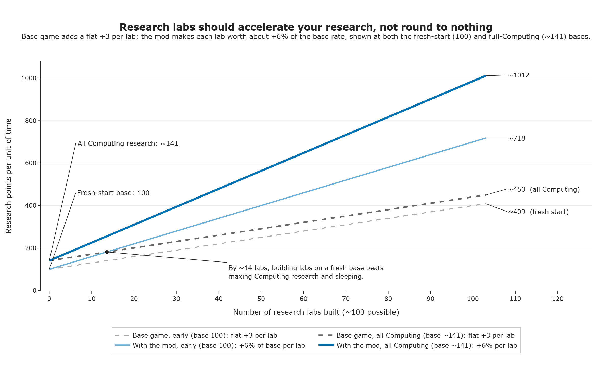

# Science Scaling

You'd expect a research lab to speed up your research rate. In the base game each lab just adds a fixed, non-scaling chunk of points on top of a large base rate, so labs barely matter. ScienceScaling makes labs a percentage of your rate instead, matching what you'd actually expect from building one.

> Labs stop being a flat bonus and start being a multiplier: the more/better labs you build, the faster every point of research compounds.

This is part of a longer balance push: get to a game where "sleep until fusion" stops being the optimal play, and settling worlds to build labs is the real path to late-game tech. This release is a step toward that, not the finished balance.

## What it does

- Turns each lab's contribution into a percentage boost on top of your current research rate, instead of vanilla's flat point-per-hour add-on. Building a second or third lab is worth noticeably more than the first.
- Gives you one dial (
  `BaseRateMultiplier`) to speed up or slow down all research across the board, without touching how labs stack against each other.
- Ships with a full on/off switch. Flip it off and research behaves exactly like unmodified Solar Expanse.

## Before / after

Vanilla: each lab adds a fixed number of research points per hour, so as your base research rate grows from tech and observatories, each additional lab matters
_less_ in relative terms. Science Scaling: each lab's bonus is applied as a multiplier on your current rate, so labs stay meaningful (and start compounding) no matter how far your research program has scaled up.

## Configuration

Settings live in
`BepInEx/config/marr75.solarexpanse.sciencescaling.cfg` and are editable in-game if you have Configuration Manager installed.

- **`Enabled`** — master on/off switch. Off = vanilla research math, unchanged.
- **`BaseRateMultiplier`
  ** — an overall speed dial for research. 1.0 is vanilla pace; 2.0 doubles every research rate; 0.5 halves it. It scales the whole system evenly, so it doesn't change how much labs matter relative to each other.
- **`LabContributionPerPoint`
  ** — how much punch each lab's bonus packs. Every lab has a built-in "lab bonus" rating (vanilla's research laboratory is worth 3 points); this setting is the percentage of your base rate that each of those points adds. At the default 0.02 that's +2% per point, so one vanilla lab gives +6%, and a second brings the total to +12% — note that only one lab fits per body, so the second has to go on another world. Data mods can change the rating; Teddit's Research Labs Rework uses 6. Higher values make investing in labs pay off faster.

## Requirements

- Solar Expanse + BepInEx 5 (Mono/x64).

## Install

1. Install BepInEx 5.
2. Drop the `ScienceScaling` folder into `BepInEx/plugins/`.

## Building (developers)

`dotnet build` deploys the DLL to the game's plugins folder via the post-build target. See `AGENTS.md`.
